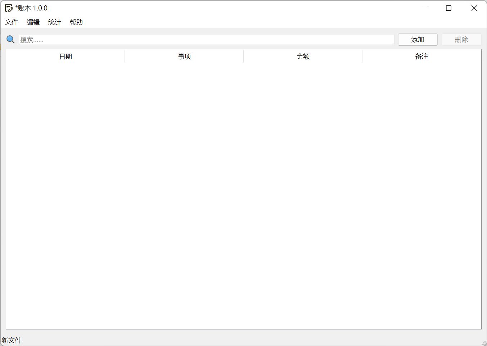
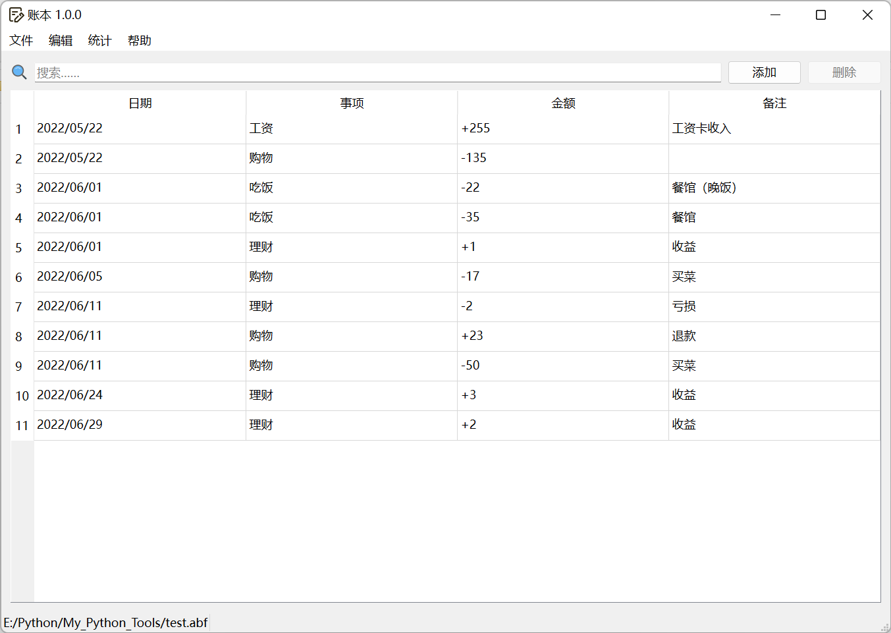
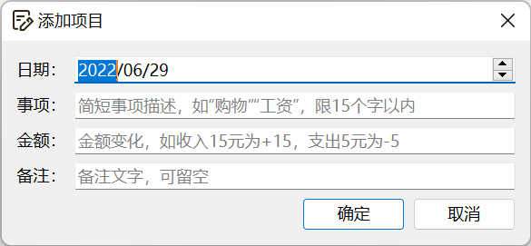
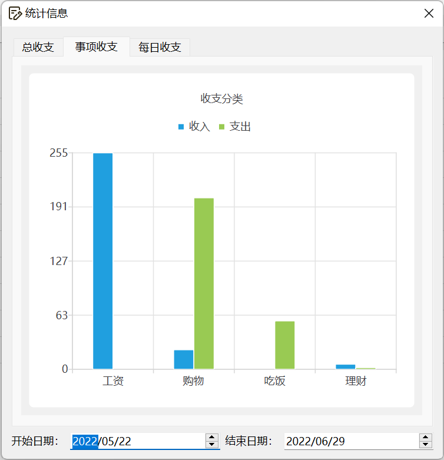

 

# AccountBook

*For English-speaking users: This project is currently CHINESE ONLY. Translation work is ongoing. If you'd like to help us with that, please open an issue or a pull request, and I'll be in contact soon. Thank you for contributing!

基于`PySide6`（Qt for Python 6）的账本，界面简洁、功能强大，支持保存文件、快速查询、绘制图表等，是平时记账的不错选择。目前exe版本仅支持Windows系统，Linux/MacOS可通过源代码手动编译或直接运行。

## 开始使用

### 从打包版本运行（Windows 7及以上）

访问[Release](https://github.com/GoodCoder666/AccountBook/releases)页面，这里提供的是独立exe文件，点击`AccountBook.exe`即可下载。

*文件由GitHub Actions完全在线自动打包发布，安全无毒，可放心使用。

这里没有提供安装包，因此如需长久使用，建议复制到常用软件的安装目录下（如`C:/Program Files`、`D:/Software`）新建空文件夹放进去，并创建快捷方式，以便使用时打开。

### 从源代码运行（全系统通用）

1. 克隆存储库：

   ```shell
   git clone https://github.com/GoodCoder666/AccountBook.git
   cd AccountBook
   ```

2. 安装依赖项&运行主程序：

   Windows：

   ```powershell
   > run
   ```

   Linux/MacOS：

   ```shell
   $ pip install -r requirements.txt
   $ cd src
   $ python3 main.py
   ```


使用如上任意一种方法运行程序后，您将看到如下界面：



此时，就可以开始工作了。

## 开发计划

已完成：

* [x] 基础账本管理
  * [X] 账目查询
  * [x] 账本编辑
  * [X] 添加/删除
  * [X] 撤销/重做
* [x] 文件操作
* [x] 统计
  * [X] 统计数据
  * [X] 生成图表

待更新：

* [ ] 自动打开文件
* [ ] 偏好设置
  * [ ] 基础设置界面
  * [ ] 全新主题
  * [ ] 不同模式（针对不同场景）
* [ ] 不同语言翻译~~（求dalao帮忙）~~
* [ ] 制作安装包
* [ ] 发布到Microsoft Store
* [ ] 云端同步
* [ ] 跨平台移植
  * [ ] 打包Linux/MacOS版本
  * [ ] 微信小程序
  * [ ] iOS/Android APP

## 屏幕截图








## FAQs

1. Q: 搜索功能的搜索依据是什么？

   A: 在每个事项中的日期、事项、金额、备注中**全部匹配**，即日期、事项、金额、备注中需有**至少一项中包含关键字**，后续会支持具体设置。功能实现代码（`src/api.py`，44-45行）：

   ```python
   def query(data, key):
       return [record for record in data if any(key in x for x in record)]
   ```

2. Q: 为什么点击了添加并正确输入数据，确定后软件表格内却不显示新事项？

   A: 很可能因为您在搜索框中输入了关键字，但添加的事项**不符合筛选条件**，因此不会在表格内显示。

## 特别鸣谢

- 本项目的[contributors](https://github.com/GoodCoder666/AccountBook/graphs/contributors)

- 素材来源：[iconfont](https://www.iconfont.cn/)

- 朋友@[studentWheat](https://github.com/studentWheat)的idea：https://blog.csdn.net/qq_67190987/article/details/124059237
